## Introducción

Para esta práctica realizaremos la configuración de una máquina virtual alojada en el servicio IaaS de la Universidad de La Laguna. Esta como otras herramientas que configuraremos son necesarias para el correcto desarrollo de la asignatura. 

## Objetivos

El objetivo de esta práctica será la configuración de todas las herramientas necesarias para llevar a cabo las distintas tareas de la asignatura, además de todo el aprendizaje que conlleva.

Configuraremos la VPN correspondiente de la Universidad para así tener acceso al servicio IaaS, el cual almacenará nuestra máquina virtual. Trabajaremos también con las conexiones remotas y sus distintos ajustes en la máquina local.

En nuestra máquina virtual llevaremos a cabo una serie de ajustes básicos y actualizaciones necesarias. Y para finalizar haremos la instalación de git y Node.js así como sus distintas configuraciones y cambios para su correcto funcionamiento. 

Para la documentación de nuestro trabajo utilizaremos GitHub, en un repositorio actualmente único para nuestra práctica. Los informes estarán en formato MarkDown en el correspondiente repositorio, estos serán procesados para ser formalizados en GitHub Pages.

## Desarrollo de la práctica

### Configuración del servicio de VPN de la ULL

En primer lugar llevaremos a cabo una serie de pasos para el correcto funcionamiento de la VPN proporcionada por la ULL, lo haremos utilizando el cliente "Global Protect". Luego de realizar una instalación en el correspondiente sistema operativo el cliente solicitará la dirección del portal al que deberá conectarse, en nuestro caso: 

```
vpn.ull.es
```


Luego de este paso podremos acceder con nuestras credenciales institucionales y obtendremos de esta forma el acceso a la red de la ULL.


### Accediendo y configurando la máquina virtual

En el servicio IaaS de la ULL tendremos habilitada una máquina virtual específica para la asignatura, la cual al arrancarla se nos asignará una entre una serie de máquinas virtuales, el nombre que esta tenga, en nuestro caso es `<DSI-27>`.

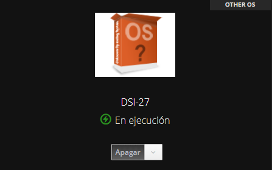

#### Accediendo a la máquina virtual

En el panel de nuestra máquina virtual en el servicio IaaS encontraremos toda la información relacionada con la máquina; necesitaremos la dirección IP asignada a la interfaz para realizar la conexión remota a nuestra máquina virtual: 

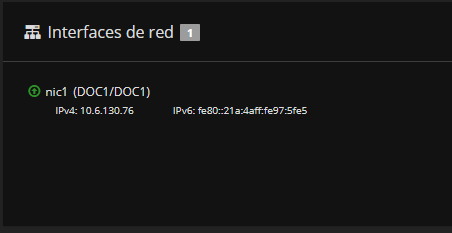

Una vez teniendo esta información nos disponemos a realizar una conexión remota con nuestra máquina virtual mediante el comando SSH. 

```
ssh usuario@10.6.130.76
```
Aceptamos el mensaje emitido por la terminal y comenzaremos a configurar nuestra máquina virtual.

#### Configuración de la máquina virtual

Las credenciales por defecto serán 
```
usuario: usuario
contraseña: usuario
```
El sistema nos pedirá que modifiquemos la contraseña, pidiendonos en primer lugar la contraseña antigua y luego introduciremos nuestra nueva credencial, tendremos que volver a iniciar sesión con esta. 

Ahora procederemos a modificar el nombre de host de nuestra máquina virtual en el fichero `/etc/hostname`:

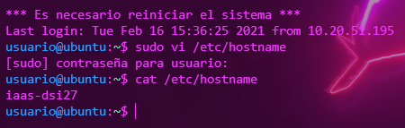

Debemos de la misma forma editar algunos parámetros del fichero `/etc/host`:

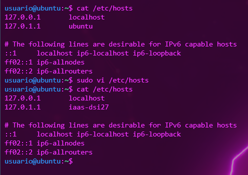

Es necesario también que actualicemos el sistema de nuestra virtual, esta acción la haremos mediante los siguientes comandos: 

```
sudo apt update
...
sudo apt upgrade
```

Al completar las actualizaciones reiniciaremos nuestra máquina virtual.

Para finalizar con la configuración generaremos las claves pública-privada en la máquina virtual: 

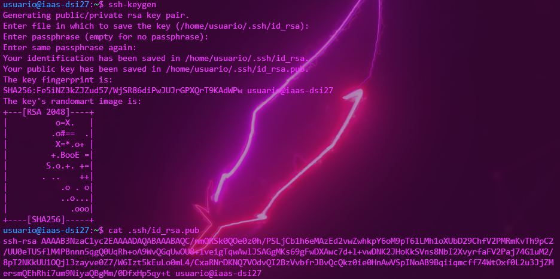

### Configuración para la máquina local

En primer lugar editaremos el fichero de host de la máquina local e incluiremos la información necesaria para que reconozca la máquina virtual. 

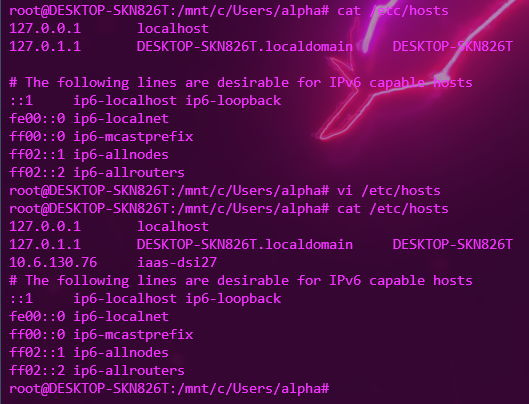

Para continuar configuraremos la infraestructura de clave pública-privada. En nuestro caso comenzaremos generando la misma:

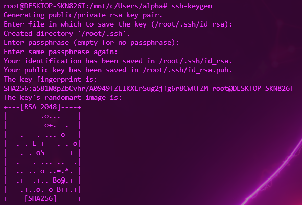

Ejecutaremos el siguiente comando que nos permitirá copiar nuestra clave pública desde la máquina local a la virtual: 

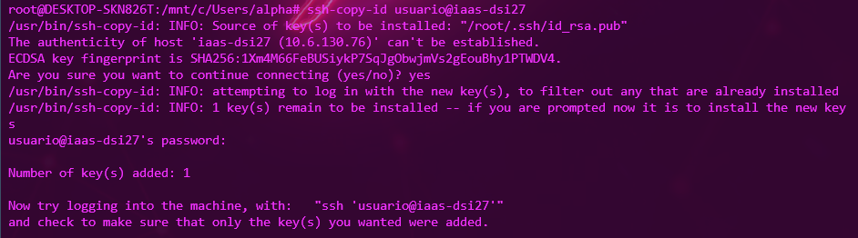

Gracias a estos ajustes que hemos hecho ahora podremos iniciar la conexión remota de nuestra máquina virtual sin necesidad de contraseña con el siguiente comando:

```
shh usuario@iaas-dsi27
```

#### Configuración adicional para la conexión remota

Realizaremos una serie de ajustes para simplificar aún mas el comando que utilizaremos para realizar una conexión remota a nuestra máquina virtual, en este caso suprimiendo el nombre "usuario" del mismo. 

Crearemos un fichero en `~/.ssh` que se llamará config y lo editaremos de la siguiente forma: 

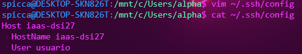

De esta forma podremos realizar la conexión remota mediante el comando SSH a nuestra máquina virtual con un comando mucho más simplificado:

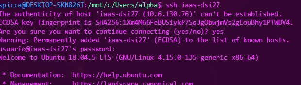


### Instalación de git y Node.js en la máquina virtual

#### Instalación y configuración de git

Comenzaremos las instalaciones con git, que generalmente suele venir preinstalado en el sistema, como fue nuestro caso: 

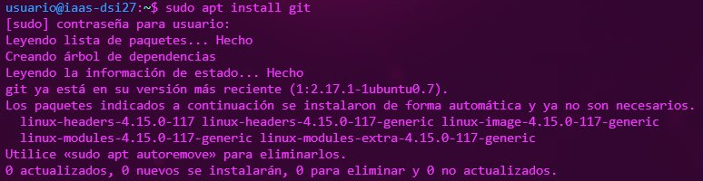

Realizaremos para git una serie de configuraciones iniciales generales, para ello ejecutaremos (en mi caso) los siguientes comandos: 

```
git config --global user.name "ccolivares"
git config --global user.email alu0101120218@ull.edu.es
```
y comprobaremos la aplicación de las mismas con: 
```
git config --list
```

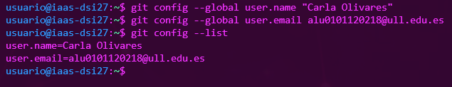

Continuaremos configurando el prompt de la terminal para que aparezca la rama actual en la que nos encontramos cuando accedemos a un directorio que está asociado a un repositorio git.

Descargaremos el script [git prompt](https://github.com/git/git/blob/master/contrib/completion/git-prompt.sh) y lo colocaremos en la raíz, cuidando que el nombre del mismo sea `.git-prompt.sh`.

Luego editaremos el archivo `~/.bashrc` e insertamos al final del contenido del archivo las siguientes líneas: 
```
source ~/.git-prompt.sh
PS1='\[\033]0;\u@\h:\w\007\]\[\033[0;34m\][\[\033[0;31m\]\w\[\033[0;32m\]($(git branch 2>/dev/null | sed -n "s/\* \(.*\)/\1/p"))\[\033[0;34m\]]$'
```

Ahora ejecutaremos el siguiente comando, que hará una acción similar a un reinicio a nuestra terminal:

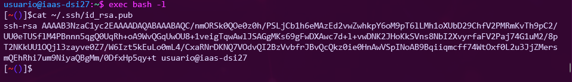

##### Añadiendo la clave pública a GitHub

Para añadir nuestra clave pública de la máquina virtual en la configuración de las claves de nuestra cuenta de GitHub la copiaremos en primer lugar: 

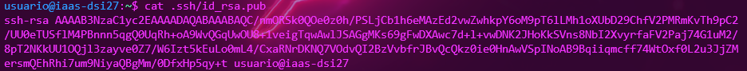

Una vez generada procedemos a modificar la configuración de nuestra cuenta personal en GitHub; nos dirigimos a *account settings*/*SSH and GPG keys* y añadimos una nueva clave SSH (add SSH key). 

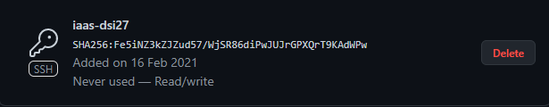

Luego de realizar esta configuración podremos clonar el repositorio desde nuestra máquina virtual:

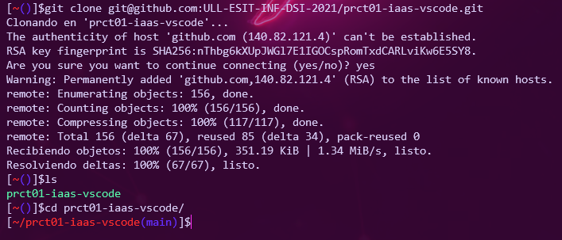

#### Instalación y configuración de Node Version Manager y Node.js

Utilizaremos el gestión de versiones de Node.js *"Node Version Manager"* (nvm). Lo instalaremos de la siguiente forma: 

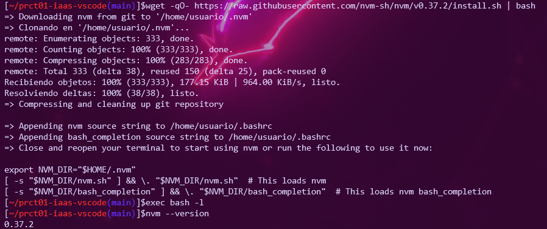

Para finalizar instalaremos la versión más reciente de Node.js:

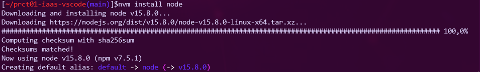

## Conclusiones

En esta práctica hemos trabajado con distintas herramientas que nos han dejado enseñanzas diversas, entre ellas una noción básica del control de GitHub así como git y sus distintos parámetros y funcionalidades. También trabajamos con las conexiones remotas necesarias y los ajustes para el correcto funcionamiento de las mismas. 
Además para este informe hemos aprendido a desenvolvernos en Markdown y GitHub Pages, de esta forma hemos investigado opciones de personalización para la formalización de nuestro trabajo. 

Todas estas enseñanzas son muy útiles para mejorar nuestros recursos y aprender a adaptarnos a distintos entornos, crear facilidades y prepararnos para desarrollar con todas las herramientas que lograrán un mejor resultado en todos nuestros proyectos.

## Bibliografía

- [Guión de la práctica 1](https://ull-esit-inf-dsi-2021.github.io/prct01-iaas/)

- [Configurando git por primera vez](https://git-scm.com/book/es/v2/Inicio---Sobre-el-Control-de-Versiones-Configurando-Git-por-primera-vez)

- [Servicio VPN de la ULL](https://www.ull.es/servicios/stic/2020/12/01/servicio-de-vpn-de-la-ull/)

- [Guía básica de Markdown](https://guides.github.com/features/mastering-markdown/)

- [Guía de GitHub Pages](https://docs.github.com/en/github/working-with-github-pages)

- [Sitio Web de Jekyll](https://jekyllrb.com)

- [Tema para GitHub Pages: Time Machine](https://github.com/pages-themes/time-machine)

