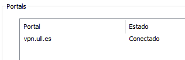
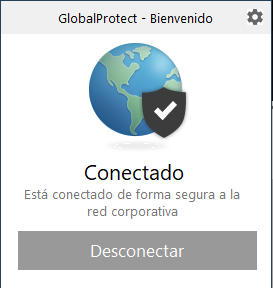

# Configuración de máquina virtual en el IaaS

- *Carla Cristina Olivares Rodríguez*
- *alu010112018@ull.edu.es*

## Introducción

Para esta práctica realizaremos la configuración de una máquina virtual alojada en el servicio IaaS de la Universidad de La Laguna. Esta como otras herramientas que configuraremos son necesarias para el correcto desarrollo de la asignatura. 

## Objetivos

El objetivo de esta practica será la configuración de todas las herramientas necesarias para llevar a cabo las distintas tareas de la asignatura, además de todo el aprendizaje que conlleva.

Configuraremos la VPN correspondiente de la Universidad para así tener acceso al servicio IaaS, el cual almacenará nuestra máquina virtual. Trabajaremos también con las conexiones remotas y sus distintos ajustes en la máquina local.

En nuestra máquina virtual llevaremos a cabo una serie de ajustes básicos y actualizaciones necesarias. Y para finalizar haremos la instalación de git y Node.js así como sus distintas configuraciones y cambios para su correcto funcionamiento. 

Para la documentación de nuestro trabajo utilizaremos GitHub, en un repositorio actualmente único para nuestra práctica. Los informes estarán en formato MarkDown en el correspondiente repositorio, estos serán procesados para ser formalizados en GitHub Pages.

## Desarrollo de la práctica

### Configuración del servicio de VPN de la ULL

En primer lugar llevaremos a cabo una serie de pasos para el correcto funcionamiento de la VPN proporcionada por la ULL, lo haremos utilizando el cliente "Global Protect". Luego de realizar una instalación en el correspondiente sistema operativo el ciente solicitará la dirección del portal al que deberá conectarse, en nuestro caso: 

```
vpn.ull.es
```


Luego de este paso podremos acceder con nuestras credenciales institucionales y obtendríamos de esta forma el acceso a la red de la ULL.



### Accediendo y configurando la máquina virtual

#### Accedemos a la máquina virtual

#### Modificar configuraciones

### Configuración para la máquina local

### Instalación de git y Node.js en la máquina virtual

